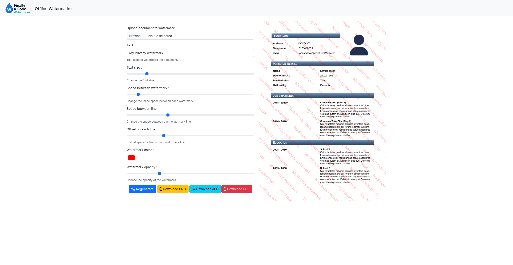

# 🔒 Watermarker Offline

**Watermarker Offline** is a 100% client-side tool that lets you apply customizable watermarking to images or PDF files, right in your browser — no upload required, no data leaves your machine.

✅ Works entirely offline  
✅ Privacy-first (everything runs locally)  
✅ Built with HTML, JavaScript, and Bootstrap  
✅ Deployable on GitLab Pages

## 🚀 Live Demo

Check out the live version here:  
📄 [https://watermarker-13b1b0.gitlab.io/](https://watermarker-13b1b0.gitlab.io/)

## ✨ Features

- **Document to watermark**  
  Supports images and PDF files.

- **Text**  
  Define your custom watermark message.

- **Text size**  
  Adjust the font size of the watermark.

- **Space between watermark**  
  Control the vertical horizontal and offset gap between watermark.

- **Watermark color**  
  Choose any color using a color picker.

- **Watermark opacity**  
  Set how transparent your watermark should appear.

## 📷 Screenshot

## 📁 How to Use Locally

1. Clone the repo
2. Open `index.html` in your browser
3. Done! Everything works locally

## 🛠 Built With

- Bootstrap 5
- JavaScript
- HTML5
- PDF.js
- PDFKit
- blob-stream
- font-awesome

## 📄 License

This project is licensed under the [GNU General Public License v3.0](https://www.gnu.org/licenses/gpl-3.0).
